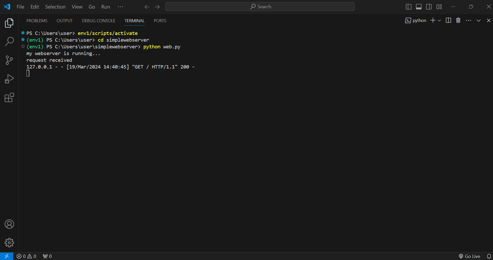
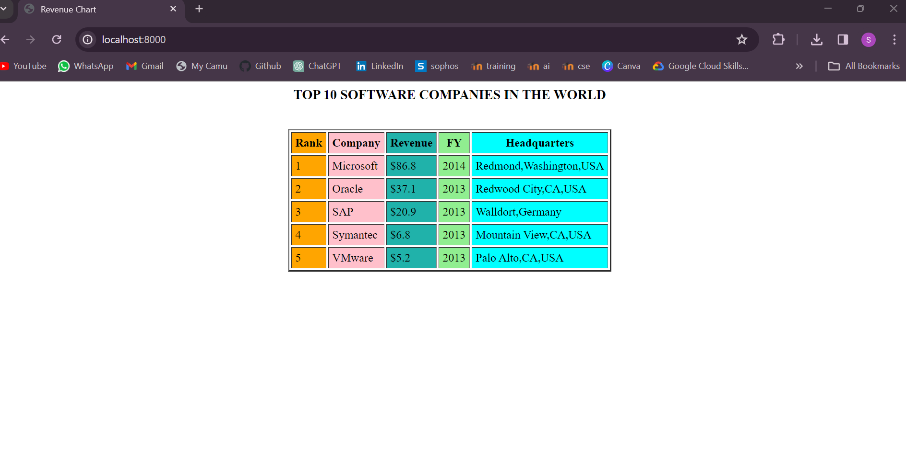

# EX01 Developing a Simple Webserver
## Date: 20.02.2023

## AIM:
To develop a simple webserver to serve html pages.

## DESIGN STEPS:
### Step 1: 
HTML content creation.

### Step 2:
Design of webserver workflow.

### Step 3:
Implementation using Python code.

### Step 4:
Serving the HTML pages.

### Step 5:
Testing the webserver.

## PROGRAM:

```
from http.server import HTTPServer, BaseHTTPRequestHandler
content = """
<html>
<head>
<title>Revenue Chart</title>
</head>
<body>
<h3 align="center">TOP 10 SOFTWARE COMPANIES IN THE WORLD</h3>
<br>
<table border="2" cellspacing="3" cellpadding="5" align="center">
<tr>
<th bgcolor="orange">Rank</th>
<th bgcolor="pink">Company</th>
<th bgcolor="lightseagreen">Revenue</th>
<th bgcolor="lightgreen">FY</th>
<th bgcolor="cyan">Headquarters</th>
</tr>
<tr>
<td bgcolor="orange">1</td>
<td bgcolor="pink">Microsoft</td>
<td bgcolor="lightseagreen">$86.8</td>
<td bgcolor="lightgreen">2014</td>
<td bgcolor="cyan">Redmond,Washington,USA</td>
</tr>
<tr>
<td bgcolor="orange">2</td>
<td bgcolor="pink">Oracle</td>
<td bgcolor="lightseagreen">$37.1</td>
<td bgcolor="lightgreen">2013</td>
<td bgcolor="cyan">Redwood City,CA,USA</td>
</tr>
<tr>
<td bgcolor="orange">3</td>
<td bgcolor="pink">SAP</td>
<td bgcolor="lightseagreen">$20.9</td>
<td bgcolor="lightgreen">2013</td>
<td bgcolor="cyan">Walldort,Germany</td>
</tr>
<tr>
<td bgcolor="orange">4</td>
<td bgcolor="pink">Symantec</td>
<td bgcolor="lightseagreen">$6.8</td>
<td bgcolor="lightgreen">2013</td>
<td bgcolor="cyan">Mountain View,CA,USA</td>
</tr>
<tr>
<td bgcolor="orange">5</td>
<td bgcolor="pink">VMware</td>
<td bgcolor="lightseagreen">$5.2</td>
<td bgcolor="lightgreen">2013</td>
<td bgcolor="cyan">Palo Alto,CA,USA</td>
</tr>
</table>
</body>
</html>
"""
class myhandler(BaseHTTPRequestHandler):
    def do_GET(self):
        print("request received")
        self.send_response(200)
        self.send_header('content-type', 'text/html; charset=utf-8')
        self.end_headers()
        self.wfile.write(content.encode())
server_address = ('',8000)
httpd = HTTPServer(server_address,myhandler)
print("my webserver is running...")
httpd.serve_forever()
```

## OUTPUT:

TERMINAL



WEB PAGE



## RESULT:
The program for implementing simple webserver is executed successfully.
